<h1 align="center">👨🏻‍💻 Seja bem-vindo(a) ao meu GitHub!</h1>

  <strong>Suporte de TI • Infraestrutura • Redes • Desenvolvimento • Dados</strong>

  📍 Limeira - SP &nbsp; • &nbsp; 🎓 Tecnólogo em Análise e Desenvolvimento de Sistemas

---

## 👋 Sobre mim

Me chamo **Renato Rissato da Silva**, tenho **21 anos** e sou formado em **Tecnologia em Análise e Desenvolvimento de Sistemas** pelo **Centro Universitário Einstein de Limeira**.

Atualmente atuo com **suporte técnico e manutenção de equipamentos**, desenvolvendo experiência prática em diagnóstico e resolução de problemas, atendimento ao usuário, configuração de equipamentos e suporte a impressoras.

Tenho interesse principalmente nas áreas de **Suporte de TI, Infraestrutura, Redes e Dados**, mantendo também contato com desenvolvimento de software e criação de aplicações.

Durante minha formação, desenvolvi projetos utilizando tecnologias como **C, JavaScript, TypeScript, HTML, CSS, SQL, PHP e Java**, além de estudar banco de dados, redes de computadores, sistemas operacionais, segurança e engenharia de software.

Também estou começando a desenvolver **sites para pequenos negócios e prestadores de serviços**, buscando aplicar na prática conhecimentos de desenvolvimento web, responsividade, experiência do usuário, integração com canais de atendimento e publicação de aplicações.

Além disso, realizo estudos e laboratórios práticos envolvendo **Windows Server, Active Directory, TCP/IP, DNS, DHCP, máquinas virtuais e redes de computadores**, com foco em ampliar meus conhecimentos em suporte e infraestrutura de TI.

> 🚀 **“Aprender fazendo e compartilhar conhecimento é o meu lema.”**

---

## 🛠️ Tecnologias & Ferramentas

### 💻 Desenvolvimento

---

### 🖥️ Suporte & Infraestrutura

**Conhecimentos:**

- Hardware e software
- Windows e Windows Server
- Active Directory
- TCP/IP
- Endereçamento IP
- DNS e DHCP
- Redes cabeadas e Wi-Fi
- Impressoras locais e de rede
- Máquinas virtuais
- Diagnóstico e resolução de problemas

---

### 📊 Dados & Banco de Dados

**Conhecimentos:**

- SQL
- SQL Server
- Modelagem de dados
- Consultas e manipulação de dados
- Banco de dados relacionais
- NoSQL
- Power BI

---

### ⚙️ Ferramentas

---

## 🚀 Projetos em Destaque

### 🚌 [SmartRoutes — Trabalho de Conclusão de Curso](https://github.com/RenatoRissato/TCC)

PWA desenvolvido como **Trabalho de Conclusão de Curso em Análise e Desenvolvimento de Sistemas**, criado para auxiliar motoristas de transporte escolar na organização da rotina diária.

O sistema permite gerenciar passageiros, acompanhar viagens e automatizar confirmações via **WhatsApp**, ajudando o motorista a identificar quais passageiros utilizarão o transporte e evitando paradas desnecessárias.

**Tecnologias utilizadas:**

`React` `TypeScript` `Vite` `Supabase` `PostgreSQL` `APIs` `PWA`

**Principais funcionalidades:**

- 👥 Gerenciamento de passageiros
- 🚌 Organização das viagens
- 🗺️ Visualização de rotas
- 💬 Confirmações automatizadas via WhatsApp
- ☁️ Backend e banco de dados com Supabase
- 📲 Aplicação Web Progressiva (PWA)
- 🔐 Controle de acesso aos dados

---

### ❄️ [Israel Ar-condicionado — Site Institucional](https://github.com/RenatoRissato/israel-ar-condicionado-site)

Site institucional desenvolvido para um prestador de serviços de **instalação, manutenção e higienização de ar-condicionado em Limeira-SP e região**.

O projeto foi desenvolvido com foco em apresentar os serviços de maneira profissional, facilitar o contato com clientes e aumentar a presença digital do negócio.

**Tecnologias utilizadas:**

`HTML5` `CSS3` `JavaScript` `Vercel`

**Principais recursos:**

- 📱 Layout responsivo
- 💬 Integração com WhatsApp
- 📝 Formulário para solicitação de orçamento
- ⭐ Área de avaliações
- ❓ FAQ interativo
- 🔎 Otimizações de SEO
- ♿ Boas práticas de acessibilidade
- ⚡ Otimizações de performance
- ☁️ Deploy na Vercel

---

### 🧺 [Lavanderia Ipê — Site Institucional](https://github.com/RenatoRissato/LavanderiaIpe-MG)

Site desenvolvido para a **Lavanderia Ipê**, lavanderia self-service localizada em **São Gotardo-MG**.

O projeto segue a identidade visual da empresa e foi desenvolvido para apresentar o funcionamento da lavanderia de maneira simples e moderna, facilitando o acesso às principais informações pelos clientes.

**Tecnologias utilizadas:**

`HTML5` `CSS3` `JavaScript` `Vercel`

**Principais recursos:**

- 📱 Interface responsiva
- 🧼 Explicação do processo de lavagem e secagem
- 💬 Integração com WhatsApp
- 🗺️ Integração com Google Maps
- 🎥 Conteúdo em vídeo
- 🖼️ Otimização de imagens
- ♿ Boas práticas de acessibilidade
- ⚡ Otimizações de carregamento
- ☁️ Deploy integrado ao GitHub e Vercel

---

### 🌤️ [Site API Clima](https://github.com/RenatoRissato/site-api-clima)

Aplicação web desenvolvida para consultar informações meteorológicas de diferentes cidades em tempo real, utilizando dados fornecidos pela **API do OpenWeatherMap**.

O projeto foi criado com foco em praticar o consumo de APIs externas, manipulação de dados em JavaScript e atualização dinâmica da interface conforme a cidade pesquisada pelo usuário.

**Tecnologias utilizadas:**

`HTML5` `CSS3` `JavaScript` `API REST` `OpenWeatherMap`

**Principais recursos:**

- 🔎 Pesquisa de clima por cidade
- 🌡️ Exibição da temperatura atual
- ☁️ Identificação das condições climáticas
- 💧 Informações de umidade
- 🌬️ Dados relacionados ao vento
- 🔄 Consumo de dados em tempo real através de API
- ⚡ Atualização dinâmica das informações na interface
- 📱 Interface adaptada para diferentes tamanhos de tela

---

### 🎮 [Jogo do Número Secreto](https://github.com/RenatoRissato/jogo-do-numero-secreto)

Jogo interativo desenvolvido para colocar em prática conceitos fundamentais de **lógica de programação utilizando JavaScript**.

O objetivo do projeto é fazer com que o jogador descubra um número gerado aleatoriamente pelo sistema, recebendo dicas a cada tentativa até encontrar a resposta correta.

**Tecnologias utilizadas:**

`HTML5` `JavaScript` `Lógica de Programação`

**Principais recursos:**

- 🎲 Geração aleatória do número secreto
- ⌨️ Entrada de tentativas pelo jogador
- 🔼 Indicação se o número secreto é maior
- 🔽 Indicação se o número secreto é menor
- ✅ Validação da resposta correta
- 🔢 Contagem de tentativas realizadas
- 🔄 Reinício da partida
- 🧠 Aplicação de condicionais, funções e lógica de programação
- 🔊 Narração das mensagens do jogo por voz

## 🎓 Formação Acadêmica

### 🎓 Tecnologia em Análise e Desenvolvimento de Sistemas

**Centro Universitário Einstein de Limeira**

Formação voltada para desenvolvimento de sistemas, banco de dados, redes de computadores, engenharia de software, desenvolvimento web, segurança da informação, infraestrutura e tecnologias aplicadas à área de TI.

---

### 📊 Técnico em Administração e Negócios

**ETEC Trajano Camargo — Limeira/SP**

Formação técnica voltada para administração, organização empresarial, processos administrativos, gestão, planejamento e rotinas do ambiente corporativo.

O curso também contribuiu para o desenvolvimento de habilidades como **organização, comunicação, trabalho em equipe e resolução de problemas**, competências que aplico atualmente também na área de tecnologia.

---

## 🏅 Certificações & Cursos

- 🎓 **Curso Prático de Redes de Computadores e Internet** — Curso em Vídeo  
- 🎓 **Começando com o Cisco Packet Tracer** — Cisco Networking Academy 
- 🎓 **Git e GitHub** — Rocketseat  
- 🎓 **Fundamentos do Suporte Técnico** — Google / Coursera  
- 🎓 **Lógica de Programação: Explore Funções e Listas** — Alura  
- 🎓 **Lógica de Programação: Mergulhe em Programação com JavaScript** — Alura  
- 🎓 **Fundamentos de TI: Hardware e Software** — Fundação Bradesco  
- 🎓 **Modelagem de Dados** — Fundação Bradesco  
- 🎓 **Introdução à Programação Orientada a Objetos (POO)** — Fundação Bradesco  

## 📈 Estatísticas do GitHub

  

  

## 📫 Entre em contato

  

  

  

---

  <strong>Obrigado pela visita! 👨🏻‍💻</strong>

  Sempre aprendendo, construindo projetos e buscando evoluir na área de tecnologia. 🚀

